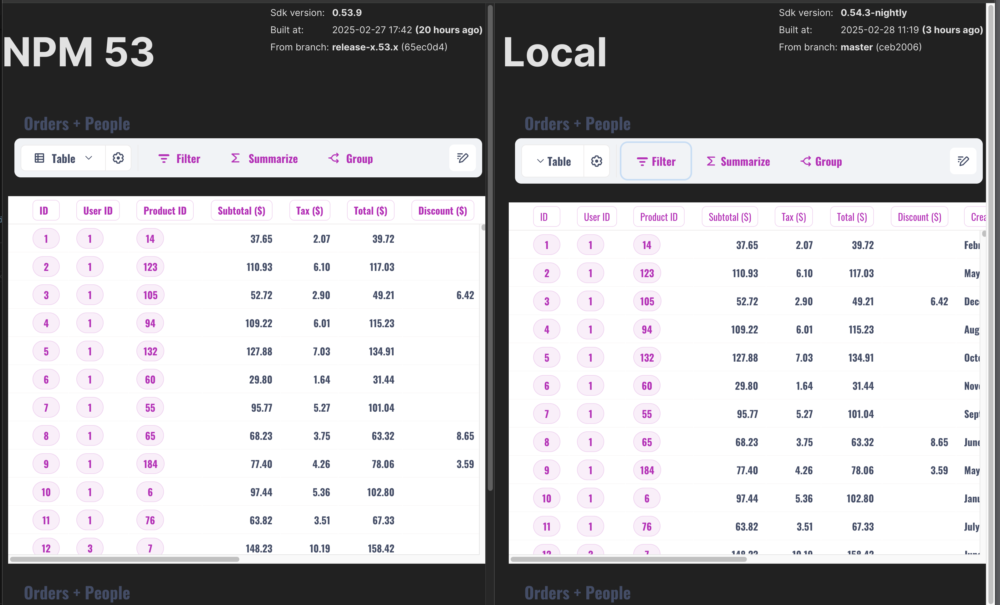

# Sdk compare

# How to use this

This project installs different versions of the sdk with different aliases, it then renders 2 iframes (to be completely isolated) side by side and renders the same jsx in each.
